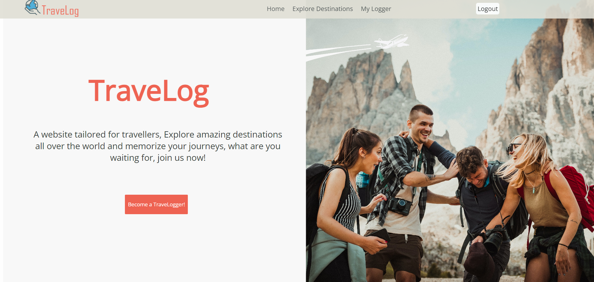
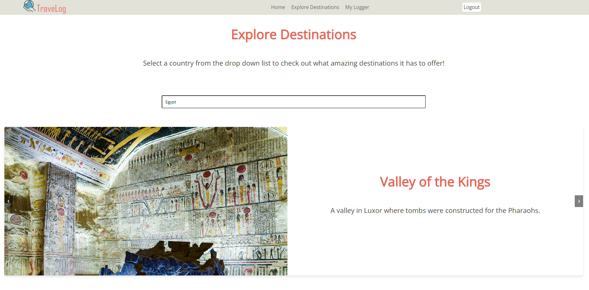
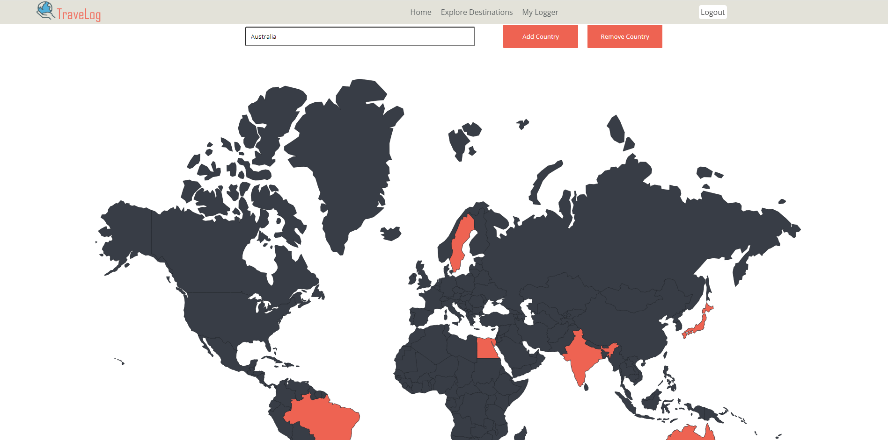

# TraveLog

Welcome to TraveLog! This ASP.NET MVC website allows users to explore tourist destinations in various countries and log the countries they have visited.

## Table of Contents

1. [Project Description](#project-description)
2. [Screenshots](#screenshots)
3. [Features](#features)
4. [How to Run](#how-to-run)
5. [Copyrights And Acknowledgements](#copyrights-and-acknowledgements)
   - [About The Author](#about-the-author)

## Project Description

TraveLog is a web application designed to help users discover new touristic destinations around the world and keep track of the countries they have visited. The website provides a simple and intuitive interface for users to explore different destinations, learn about them, and log their travels and check it out on a world-map!

## Screenshots

Home screen featuring a simple adventure inspired design.



Explore various destinations in different countries



Log your visited countries and check out which countries you have visited on the world map!



## Features

- **ASP.NET Core 8 MVC**: Utilizes the latest ASP.NET Core framework to build a robust and scalable web application.
- **Identity**: Integrated user authentication using ASP.NET Core Identity.
- **Entity Framework Core**: Leveraging EF Core for efficient data access and management.
- **Toastr Notifications**: Provides real-time notifications to enhance user experience.
- **Responsive Design**: Ensures the website is accessible and usable on various devices and screen sizes.

## How to Run

To run the TraveLog project on your local machine, follow these steps:

1. **Clone the repository**:

   ```sh
   git clone https://github.com/Mena-Ibrahim/TraveLog.git
   cd TraveLog
   ```

2. **Update the connection string**:
   Open `appsettings.json` and update the connection string to match your server name and credentials.

   ```json
   "ConnectionStrings": {
     "DefaultConnection": "Server=YOUR_SERVER_NAME;Database=TraveLogDb;User Id=YOUR_USERNAME;Password=YOUR_PASSWORD;"
   }
   ```

3. **Apply database migrations**:
   Open the NuGet Package Manager Console and run the following command:

   ```sh
   update-database
   ```

4. **Run the application**:
   Build and run the application using Visual Studio or the .NET CLI.

   ```sh
   dotnet run
   ```

## Copyrights And Acknowledgements

This project is solely done by me, the author Mena Ashraf.

### About The Author

- **Name**: Mena Ashraf Mikhael Saleh
- **Email**: [Mena.a.saleh.2001@gmail.com](mailto:Mena.a.saleh.2001@gmail.com)
- **GitHub**: [https://github.com/Mena-Ibrahim](https://github.com/Mena-Ibrahim)
- **LinkedIn**: [https://www.linkedin.com/in/mena-saleh-23b947167/](https://www.linkedin.com/in/mena-saleh-23b947167/)

Thank you for exploring TraveLog! If you have any questions or feedback, feel free to reach out.
